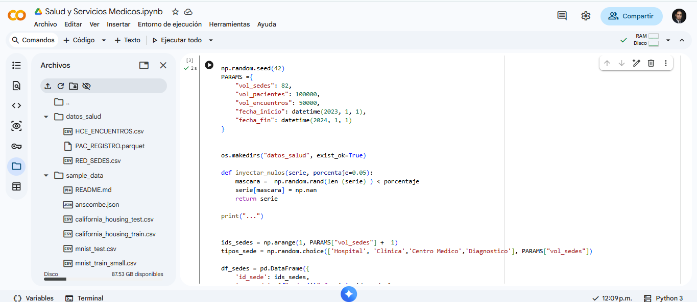
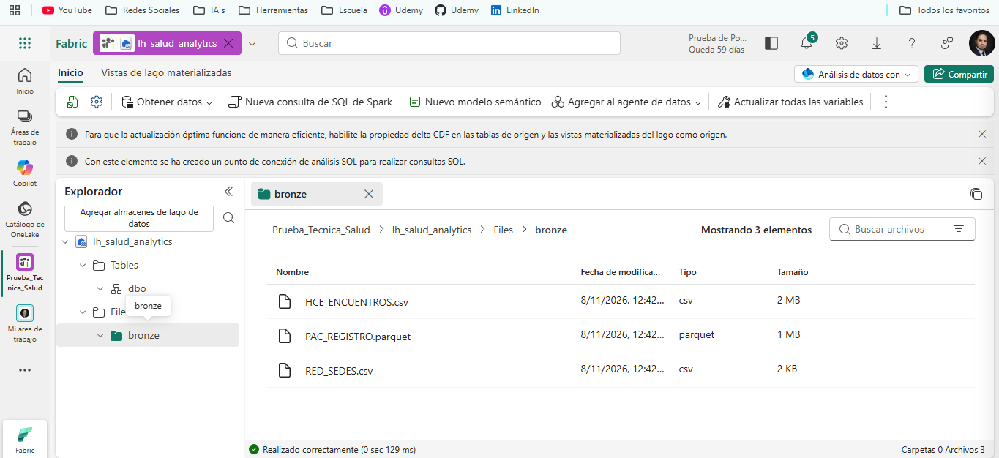
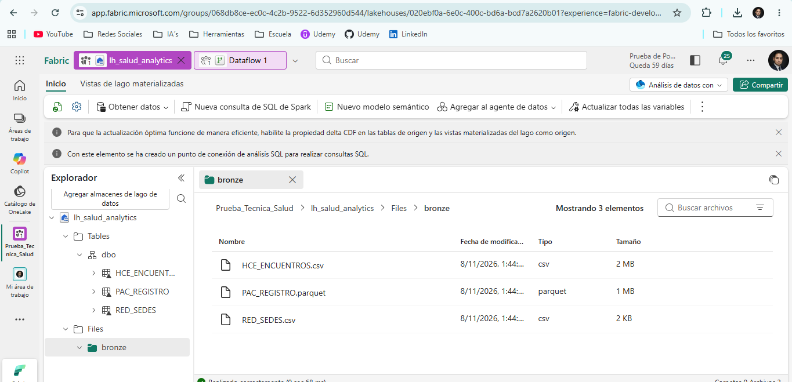
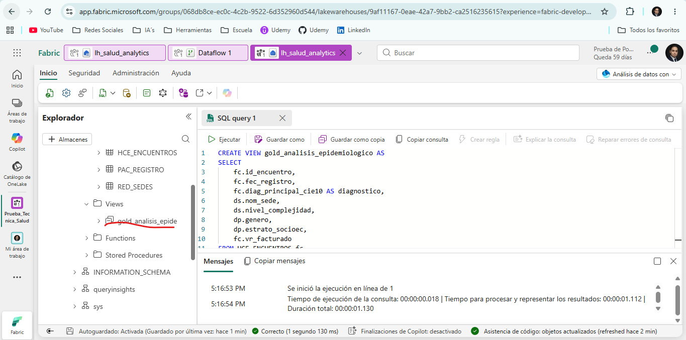
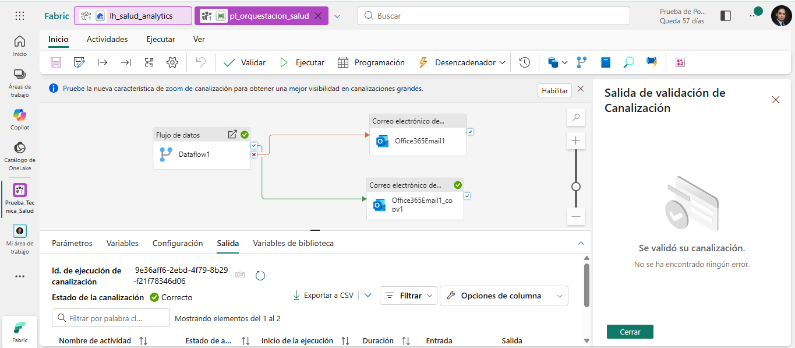

# Prueba Técnica — Ingeniería de Datos

Como recién egresado mis fortalezas se encuentran en el análisis de datos y mi conocimiento en phyton, esta prueba técnica fue mi primer acercamiento a la ingeniería de datos en la nube y la arquitectura de medallón. Teniendo en cuenta el tiempo y para demostrar que tengo capacidad de adaptación tome la desición de priorizar un flujo End-to-End funcional usando Microsoft Fabric, y prescindiendo de la infraestructura como código para entregar algo funcional a pesar de no poder cubrir con todos los requisitos de la prueba. Mi enfoque entonces será resolver el problema de negocio y documentar mi curva de aprendizaje.

Como primera parte quiero dar una justificación al por que escogí el escenario C- SALUD Y SERVICIOS MEDICOS, durante mi formación académica uno de mis proyectos más relevantes fue la creación de un artículo sobre Patrones espacio-temporales de violencia de género en la CDMX, y ya que en el escenario C, uno de los requisitos es detectar brotes epidemiológicos, sentí que era similar a buscar estos patrones históricos que hice en el artículo, sobre todo por el manejo de datos de pacientes y tiempos, similar en mi artículo a cuando manejaba datos de víctimas y las eventualidades.

Como primera parte se crearon los datos sintéticos, para ello me apoye de la plataforma Colab para correr phyton, como se puede ver en la imagen 1, ahí genere un Scrip para generar los datos de acuerdo a lo solicitado en la fase 1 de la prueba.

### Evidencia — Imagen 1

Me conecte al servicio de Microsoft Fabric, escogi este servicio ya que al investigar parecía la mejor opción contra AWS o GCP, esto para evitar configurar bases de datos, almacenamiento, permisos de red o herramientas separadas, y aquí todo eso está junto en la misma plataforma, así mismo su modelo de prueba de 60 días en vez del de créditos, me permite realizar más pruebas sin llegar a un tope.

Siguiendo lo investigado sobre la arquitectura de medallón, dentro de Microsoft Fabrik se creo un lakehouse, dentro se creo una carpeta llamada bronze, y dentro se cargaron los archivos generados en Microsoft colab de: RED\_SEDES.csv, PAC\_REGISTRO.parque y HCE\_ENCUENTROS.csv, esto se puede ver en la imagen 2.

### Evidencia — Imagen 2

Dentro del entorno de trabajo de Microsoft Fabric, usando un dataflow, cargue los 3 archivos csv, que son PAC\_REGISTRO, RED\_SEDES y HCE\_ENCUENTROS, y usando las herramientas graficas aplique los filtros necesarios para la limpieza de datos. Posteriormente hice un guardado de las nuevas tablas con los filtros, como se ve en la imagen 3.

### Evidencia — Imagen 3

El siguiente paso es usando la herramienta de conexión de análisis SQL, se generara una vista para poder hacer el análisis, uniendo solo las columnas que buscamos analizar de las 3 tablas. Se ejecuta un scrip y se crea una vista como se puede ver en la imagen 4.

### Evidencia — Imagen 4

Ahora como siguiente actividad, se crea una canalización con la que creare una pipeline que configurare para nortificar a correo electrónico si falla o no da error nuestro dataflow, como se ve en la imagen 5.

### Evidencia — Imagen 5

Por último, para cubrir el requerimiento de garantizar la seguridad y como se priorizo el flujo end-to-end visual, se cubre esta parte de forma teórica abordando el requisito con un documento técnico de Seguridad y Gobierno de calidad que explica cómo manejar la información.

# Gobierno, Seguridad y Calidad de Datos

## Seguridad (Principio de Mínimo Privilegio)

Para un despliegue en producción, el control de accesos al espacio de trabajo se estructuraría mediante los siguientes roles:

| Rol Asignado | Nivel de Acceso en Fabric | Permisos Específicos |
|---|---|---|
| Ingeniero de Datos | Member / Contributor | Lectura/Escritura en capas Bronze y Silver. Creación de pipelines y flujos de datos. |
| Analista de Datos | Viewer | Solo lectura sobre el SQL Endpoint de la capa Gold para conectar tableros de Power BI. |
| Administrador | Admin | Gestión de accesos, monitoreo de costos y configuración del Lakehouse. |

# Linaje de Datos (Data Lineage)

A continuación, se detalla el linaje de los campos críticos expuestos en la capa Gold para el análisis epidemiológico:

| Campo en Capa Gold | Origen (Capa Bronze) | Transformación (Capa Silver) |
|---|---|---|
| diagnostico | HCE\_ENCUENTROS.csv (diag\_principal\_cie10) | Ingesta directa sin transformación. Cruce mediante pac\_id. |
| genero | PAC\_REGISTRO.csv (genero) | Filtrado de exclusión para pacientes con fec\_nac > 2026. |
| vr\_facturado | HCE\_ENCUENTROS.csv (vr\_facturado) | Regla de calidad aplicada: Exclusión de montos < 0. |
